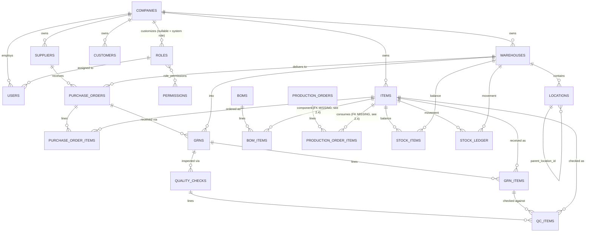

# ERP Manufacturing V1 — Architecture Audit Report

**Date:** 2026-08-08
**Scope:** `erp-backend` (NestJS/TypeORM) + `erp-frontend` (Next.js), current working tree (branch `ui/premium-design-system`, includes the uncommitted multi-company changes).
**Method:** Direct source inspection — every finding below cites the file(s) it came from. Nothing here is inferred from framework defaults or guessed; where I couldn't verify something from code alone (e.g. actual production traffic, DB row counts), it's flagged explicitly rather than assumed.

---

## 1. Current Architecture

### 1.1 Frontend
- **Framework:** Next.js 15.5 (App Router), React 19, TypeScript + plain `.js`/`.jsx` mixed in the same `src/app` tree (`erp-frontend/package.json`).
- **UI:** MUI v7 (`@mui/material`, `@mui/icons-material`) + Emotion.
- **Animation:** three separate libraries installed simultaneously — `framer-motion`, `gsap`, and `animejs`. No evidence of a deliberate split (e.g. framer for React components, gsap for one special sequence); likely accretion over time.
- **State:** Zustand (`src/store/user.ts`) for client auth/user state.
- **Charts:** Chart.js via `react-chartjs-2`.
- **Data access:** a single hand-rolled fetch wrapper, `src/lib/apiClient.ts`, which resolves the backend base URL, attaches the JWT from a cookie, and unwraps the backend's `{success,message,data}` envelope. This is a clean, non-duplicated pattern — no per-page fetch boilerplate found.
- **Auth gating:** `middleware.ts` redirects based on **cookie presence only** — it does not verify the JWT is unexpired or well-formed, so an expired token still passes route guarding and only fails on the first API call.
- **Testing:** Playwright is installed and configured (`playwright.config.ts`), but only one spec exists — `tests/dashboard.spec.ts`. No test covers the ~35 other pages under `src/app`.
- **Supabase:** `@supabase/supabase-js` is a frontend dependency, but no usage of it was found anywhere under `erp-frontend/src` — likely leftover from an earlier direction (see §3.1 dead dependencies).

### 1.2 Backend
- **Framework:** NestJS 11, TypeORM 0.3, class-validator/class-transformer for DTOs.
- **Database driver:** PostgreSQL (`pg`) is the one actually configured (`app.module.ts`, `data-source.ts`) — connects either via `DATABASE_URL` (Supabase-style) or discrete `DB_HOST`/`DB_PORT`/etc., with a SQLite fallback for offline dev. `mysql2` is also a dependency but nothing in `src/` references a MySQL connection — dead dependency (§3.1).
- **Schema management:** real TypeORM migrations now exist (`src/migrations/1786010324138-InitialMultiCompanySchema.ts`), `synchronize: false`, `migrationsRun: true` on boot. This is a recent, deliberate hardening — the in-code comment in `app.module.ts:45-50` documents the switch away from auto-sync.
- **API shape:** global prefix `/api` (`main.ts:12`), global `ValidationPipe` (whitelist + forbidNonWhitelisted + transform), a global `HttpExceptionFilter`, and a global `TransformInterceptor` producing a consistent `{success, message, data}` envelope. This is good, consistent practice — not every NestJS project bothers.
- **Module structure:** 21 feature modules registered in `app.module.ts` — auth, users, companies, suppliers, customers, items, warehouses, locations, purchase-orders, grn, quality-checks, production, bom, stocks, inventory, dispatch, fgr (finished-goods-receipt), dashboard, reports, rbac/roles, system. One-module-per-domain, each with its own controller/service/entity/dto — a conventional, easy-to-navigate layout.
- **No API versioning** (`/api/...`, not `/api/v1/...`). Fine today; will need a decision before any breaking V2 change ships alongside V1 clients.

### 1.3 Authentication flow
`erp-backend/src/auth/`:
1. `POST /api/auth/login` → `AuthService.validateUser` (bcrypt compare) → `AuthService.login` issues a 15-minute access JWT (`{sub, username, email, roleId, type:'access'}`) and a 7-day refresh JWT, and persists a hash of the refresh token on the user row (`updateRefreshToken`).
2. `JwtStrategy.validate()` (`jwt.strategy.ts`) re-fetches the **live** user row (with role + permissions) from the DB on every single request rather than trusting the JWT payload — deliberately, per its own comment, so a permission/role change takes effect immediately instead of waiting for token expiry. Correct, if slightly more DB load per request (see §1.6).
3. `company_id` is resolved fresh from that same DB row into `req.user.companyId`, never trusted from the JWT (`jwt.strategy.ts:62-67`) — good, since the access-token payload itself doesn't carry `company_id` at all.
4. `CompanyId()` param decorator (`common/decorators/company-id.decorator.ts`) throws `401` rather than silently passing `undefined` if `req.user.companyId` is missing — a good fail-closed default that every company-scoped controller method uses.
5. Refresh flow (`POST /api/auth/refresh`) validates the presented refresh token's hash against the stored one before issuing a new access token.

**Gaps:**
- No rate limiting anywhere (`@nestjs/throttler` is not a dependency, and no custom throttling was found) — `/api/auth/login` and the public `POST /api/companies` self-registration endpoint (§1.4) are both open to unlimited attempts.
- No password complexity policy beyond a 6-character minimum (`auth.service.ts:21`).
- No account lockout / backoff after repeated failed logins.
- No CSRF story to evaluate — irrelevant while the frontend sends the JWT as a `Bearer` header (not a cookie the browser auto-attaches to cross-site requests), but worth stating explicitly since the token *is* also stored in a cookie (`js-cookie`) for the middleware to read.

### 1.4 Authorization flow
Two independent guard layers, applied per-controller (no global guard registration in `main.ts`):
- **`RolesGuard`** (`auth/guards/roles.guard.ts`) — coarse, checks `user.role` against `@Roles(...)`.
- **`PermissionsGuard`** (`rbac/guards/permissions.guard.ts`) — fine-grained, checks `user.permissions[]` (flattened from `roleRelation.permissions`) against `@RequirePermissions(...)`.

Both exist, but only `RolesGuard`+`@Roles()` is actually wired into controllers I inspected (items, companies, etc.) — `PermissionsGuard` and its decorator exist as infrastructure but I did not find a controller using `@RequirePermissions()` in the files sampled. **This needs a repo-wide grep before V2 design assumes fine-grained permissions are enforced today** — right now the enforced model is role-based, not the full permission-matrix the RBAC entities (`Permission`, `Role.permissions`) suggest.

Tenant isolation (the actual "authorization" that matters most for a multi-company system) is enforced **in each service method**, not by a shared guard/interceptor — every `findAll`/`findOne`/`update`/`remove` I read (`items.service.ts`, `inventory.service.ts`, `reports.service.ts`, `roles.service.ts`) takes an explicit `companyId` parameter and filters on it. This is consistent everywhere sampled, which is good, but it also means **there is no structural guarantee** — a new module added later without remembering to thread `companyId` through would silently leak cross-tenant data, and nothing in the framework would catch it. A shared TypeORM subscriber, a repository base class, or Postgres Row-Level Security would make this a structural guarantee instead of a code-review discipline. Worth prioritizing in V2 (§ recommendations).

### 1.5 Deployment architecture
- **No Dockerfile, no docker-compose, no Kubernetes manifests anywhere in the repo.**
- The only CI workflow present is `.github/workflows/generator-generic-ossf-slsa3-publish.yml` — a supply-chain provenance/attestation generator, **not** a build/lint/test pipeline. There is no CI gate that runs `npm run lint`, `npm test`, or `npm run build` on push/PR for either app.
- `erp-backend/.env.example` documents the required env vars (`DATABASE_URL`, `DB_SSL`, `JWT_SECRET`, etc.) but there's no `docker-compose.yml` to spin up Postgres+backend+frontend together for a new contributor.
- Backend port (`3001`) is hardcoded in `main.ts:35` (`app.listen(3001)`), not read from `process.env.PORT` — the frontend then independently hardcodes the same `3001` as its dev fallback in `apiClient.ts:25`. Two places to keep in sync by hand.

### 1.6 Performance bottlenecks (evidence-based, not load-tested)
- `JwtStrategy.validate()` does a full DB round-trip (user + role + permissions join) on **every authenticated request**. Reasonable at today's scale; at "100,000+ orders" scale this becomes the single hottest query path in the system and should move to a short-TTL cache (Redis, or even an in-process LRU keyed by user id + a version/`updated_at` stamp) rather than a bare per-request DB hit.
- `InventoryService.decreaseStock`/`increaseStock` (`inventory.service.ts:60-183`) do read-then-write without row locking: `findOne` → compute in application memory → `save`. Under concurrent requests against the same `(item_id, warehouse_id)` — e.g. two dispatches or a dispatch racing a GRN — this is a classic lost-update race: both reads see the same `prevQty`, both writes overwrite each other, and the stock_ledger balance can end up wrong or (worse) go negative despite the app-level `if (prevQty < qty) throw`. The `queryRunner` parameter exists for transactional callers but no call site I found applies `.setLock('pessimistic_write')`. **This is a correctness bug, not just a performance one, once traffic is concurrent** — flag as P0 for V2's inventory engine.
- Only one DB index beyond primary keys and unique constraints exists on any `company_id` column (`stock_ledger`, via `IDX_d1bf26e3164bb46b8b7be287bb` in the migration) — see §2.3.
- `getLedger()` (`inventory.service.ts:292`) hardcodes `.limit(500)` with no pagination — fine at current volume, will need cursor/offset pagination once ledger rows are in the millions (explicit V2 target).

### 1.7 Security issues
1. **No rate limiting / brute-force protection** on login or the public company-signup endpoint (§1.3).
2. **Race condition in stock mutation** allowing incorrect or negative inventory under concurrency (§1.6) — a data-integrity issue with financial impact (landed-cost/valuation math in V2 will compound whatever the stock number is).
3. **Dead entity files still loaded by TypeORM's glob** (`entities: [__dirname + '/**/*.entity{.ts,.js}']` in `app.module.ts:94`) — see §3.2. Two unrelated classes both decorated `@Entity('quality_checks')` sitting in the same metadata registry is fragile; whether it currently throws at boot, silently shadows one mapping, or just wastes a migration-diff cycle depends on TypeORM's exact conflict behavior for this version, but it's a footgun either way and should be deleted, not left "because it hasn't broken yet."
4. **CORS is fully open** — `app.enableCors()` with no origin allow-list (`main.ts:33`). Fine for local dev, must be locked to the actual frontend origin(s) before any production/staging deploy.
5. Two password-hashing libraries installed (`bcrypt` + `bcryptjs`) — only `bcrypt` is imported in the code I found (`auth.service.ts:5`). Not a vulnerability by itself, but two crypto-adjacent dependencies doing the same job is exactly the kind of thing that causes someone to import the wrong one later.
6. `.env` (not `.env.example`) exists in the working tree and is presumably git-ignored (`erp-backend/.gitignore` — not independently re-verified here, standard NestJS gitignore includes `.env`); flagging only so V2 setup docs explicitly warn against ever committing it.

### 1.8 Missing enterprise features
Relative to the TITAN wishlist, essentially everything past "multi-company + basic RBAC + core manufacturing/inventory/purchase/sales CRUD" is genuinely absent from the current codebase — not partially built, just not started:
- No MRP engine, no BOM cost rollup/versioning/approval (BOM entity exists but is a flat single-version list — `bom/entities/bom.entity.ts`).
- No warehouse zones/racks/bins (only `warehouses` + a generic `locations` table with a `location_type` enum — `area/rack/bin/floor/cold_storage/quarantine` — so bin-level tracking has a schema seed but no batch/lot/serial/expiry tracking on top of it).
- No batch/lot/serial/expiry tracking anywhere in the `items`/`stock_items` schema.
- No barcode/QR generation.
- No CRM pipeline (leads/quotations/won-lost), no finance module (chart of accounts, journal entries, GST reports, P&L, balance sheet), no landed-cost/import-costing engine, no e-commerce connectors, no workflow/approval engine, no notification center, no AI layer, no audit-trail table, no PWA/offline mobile support.
- **This is expected** — it confirms the TITAN mission is a genuine build-out, not a refactor, and should be scoped/roadmapped accordingly rather than estimated as "add a feature to an existing module."

---

## 2. Database Audit

### 2.1 Current table inventory
From `src/migrations/1786010324138-InitialMultiCompanySchema.ts` (the only migration; schema `erp_test`):

| Table | Tenant column | Notes |
|---|---|---|
| `companies` | — (tenant root) | |
| `warehouses` | `company_id` | unique `(company_id, code)` |
| `suppliers` | `company_id` | unique `(company_id, email)`, `(company_id, supplier_code)` |
| `customers` | `company_id` | unique `(company_id, email)`, `(company_id, customer_code)` |
| `items` | `company_id` | unique `(company_id, sku)`; index on `name` only |
| `locations` | `company_id` | self-referencing `parent_location_id`; unique `(company_id, location_code)` |
| `stocks` | `company_id` | legacy-looking flat stock table (denormalized `item_name`/`warehouse_name` strings) — **appears to duplicate `stock_items`**, see §3.1 |
| `stock_items` | `company_id` | current-balance table, unique `(item_id, warehouse_id)` — **not company-scoped in its own unique constraint**, see §2.4 |
| `stock_ledger` | `company_id` | append-only movement log; only table with an explicit `company_id` index |
| `purchase_orders` / `purchase_order_items` | `company_id` (header only) | unique `(company_id, po_number)` |
| `grns` / `grn_items` | `company_id` (header only) | unique `(company_id, grn_number)` |
| `quality_checks` / `qc_items` | `company_id` (header only) | unique `(company_id, qc_number)` |
| `quality_check_items` | none | **dead table**, see §3.2 |
| `production_orders` / `production_order_items` | `company_id` (header only) | unique `(company_id, order_number)` |
| `boms` / `bom_items` | `company_id` (header only) | |
| `dispatch_orders` | `company_id` | unique `(company_id, dispatch_number)` |
| `finished_goods_receipts` | `company_id` | unique `(company_id, receipt_number)` |
| `roles` | `company_id` (nullable) | `NULL` = shared system role; unique `(company_id, name)` |
| `permissions` | — (global) | |
| `role_permissions` | — (join table) | |
| `users` | `company_id` | |

### 2.2 ER diagram (core relationships)

*(Simplified — omits `stocks`/`dispatch_orders`/`finished_goods_receipts`, which are currently flat/denormalized rather than FK-linked; see §2.4 and §3.1.)*

### 2.3 Missing indexes
Sixteen tables carry a `company_id` column that every list/report query filters on (confirmed in `items.service.ts`, `reports.service.ts`, `inventory.service.ts`, etc. — every `findAll` starts `WHERE company_id = :companyId`). Of those sixteen, **only `stock_ledger` has an explicit index on `company_id`** (`IDX_d1bf26e3164bb46b8b7be287bb`). The rest rely entirely on whatever incidental index Postgres builds for a `UNIQUE(company_id, other_col)` constraint — which helps a lookup that includes `other_col`, but does **not** help a plain `WHERE company_id = :x ORDER BY name` list query, which is the majority of the traffic in this app (every index/dashboard/report page).

Tables with `company_id` and no supporting index at all: `warehouses`, `suppliers`, `items` *(has a unique-composite that partially helps + a separate `name` index, but nothing on `company_id` alone)*, `purchase_orders`, `grns`, `production_orders`, `locations`, `stock_items`, `dispatch_orders`, `finished_goods_receipts`, `customers`, `roles`, `users`, `boms`, `stocks`.

At current (presumably low) row counts this is invisible. At the stated V2 target (100k+ orders, 1M+ inventory transactions) every one of these becomes a sequential scan. **Recommend a migration adding a plain b-tree index on `company_id` to every listed table before any load/seed test**, plus composite `(company_id, created_at)` or `(company_id, status)` indexes on the transactional tables (`purchase_orders`, `production_orders`, `dispatch_orders`) once V2's actual dashboard query patterns are finalized.

### 2.4 Missing foreign keys
Confirmed by diffing the migration's `CREATE TABLE` column lists against its `ADD CONSTRAINT ... FOREIGN KEY` statements:
- **`bom_items.item_id` → `items.id` — no FK constraint exists.** `bom_items` only has an FK on `bom_id`; the component-item reference is an unconstrained integer.
- **`production_order_items.item_id` → `items.id` — no FK constraint exists.** Same pattern — only `production_order_id` is constrained.

Both are real gaps, not stylistic choices — every sibling table (`purchase_order_items.item_id`, `grn_items.itemId`, `qc_items.itemId`) *does* have the FK. A deleted or mistyped item id in a BOM or production order line would currently insert successfully and only fail later, at read time, when the join to `items` returns nothing. Add these two FKs in the next migration (`RESTRICT` or `NO ACTION`, matching the sibling tables' convention, not `CASCADE` — you don't want deleting an item to silently delete BOM history).

Also note: `stock_items` has a unique constraint on `(item_id, warehouse_id)` **without `company_id`** (§2.1) — since `item_id`/`warehouse_id` already belong to exactly one company transitively via their own FKs, this isn't a tenant-isolation bug today, but it does mean the "one balance row per item+warehouse" invariant isn't company-qualified in the constraint itself; worth tightening to `(company_id, item_id, warehouse_id)` for defense-in-depth when the FK/index migration above is written anyway.

### 2.5 Data integrity risks
1. **Stock race condition** (§1.6) — the most serious integrity risk in the current system; not locking the read-modify-write cycle on `stock_items` means concurrent writers can corrupt the balance.
2. **Two FK gaps** above (§2.4).
3. **`stocks` vs `stock_items`/`stock_ledger` duplication** (§3.1) — two different tables can independently claim to represent "current stock," with no mechanism keeping them in sync. If both are actually read from anywhere in the frontend, they can disagree.
4. **Dead `quality_check_items` table** created by the migration but never written to by any live code path (§3.2) — schema noise today, a trap for a future developer who finds the table and assumes it's the real one.
5. No soft-delete-aware uniqueness: several entities use `deleted_at` (soft delete) alongside a plain unique constraint (e.g. `items` unique on `(company_id, sku)` with no `WHERE deleted_at IS NULL` partial-index qualifier). Soft-deleting an item and creating a new one with the same SKU will hit a unique-constraint violation even though the old row is "deleted." Worth a partial unique index (`... WHERE deleted_at IS NULL`) wherever soft delete and uniqueness combine.

### 2.6 Scalability concerns
- Missing indexes (§2.3) are the primary concern for the stated 100k-orders/1M-transactions target.
- `stock_ledger` is append-only and will be the single fastest-growing table by a wide margin (every stock movement writes one row) — plan partitioning (by `company_id` and/or month) before it reaches the "million transactions" mark the mission calls out, rather than after.
- No caching layer anywhere (no Redis dependency in either `package.json`) — the dashboard endpoint (`dashboard.controller.ts`) fires ~10 parallel count/aggregate queries per request with no memoization; fine now, will need caching once "fast dashboard load" is a hard requirement at scale.
- `getLedger()`'s hardcoded `LIMIT 500` with no offset/cursor param (§1.6) will need real pagination.

---

## 3. Code Quality Audit

### 3.1 Dead code / duplicate code
- **Duplicate/likely-dead dependencies:**
  - Backend: `mysql2` (no MySQL connection configured anywhere; Postgres is the only driver used), `bcryptjs` (only `bcrypt` is imported), `jsonwebtoken` (the app uses `@nestjs/jwt`'s `JwtService` throughout — `jsonwebtoken` itself wasn't found imported directly in the sampled files, worth a repo-wide grep to confirm before removing).
  - Frontend: `@supabase/supabase-js` (no usage found under `erp-frontend/src`), `mysql2` (a *frontend* package depending on a DB driver is itself a smell — almost certainly copy-pasted from the backend's `package.json` and never used).
  - Three animation libraries (`framer-motion`, `gsap`, `animejs`) installed together — consolidate to one unless there's a documented reason for each.
- **Duplicate table/entity definitions:** `src/quality-checks/quality-check.entity.ts` and `quality-check-item.entity.ts` (module root) are near-duplicates of `src/quality-checks/entities/quality-check.entity.ts` and `entities/qc-item.entity.ts` — same table name (`quality_checks`), different TypeScript class, different column set (the root version predates the multi-company `company_id` column and doesn't have it). **Confirmed dead**: nothing outside these two files imports them (`grep` across `src/` turns up only their mutual reference to each other). Because `app.module.ts:94` loads entities via a glob (`__dirname + '/**/*.entity{.ts,.js}'`), TypeORM still picks these up at boot alongside the real ones — two classes both mapped to `@Entity('quality_checks')`. **Action: delete both root-level files** (`quality-check.entity.ts`, `quality-check-item.entity.ts`) and, in the next migration, `DROP TABLE quality_check_items` (the orphaned table their entity created, distinct from the real `qc_items` table).
- **`stocks` table** (flat, denormalized `item_name`/`warehouse_name` strings, its own `company_id`) appears to be an earlier, simpler stock model that `stock_items` + `stock_ledger` superseded. `StocksService`/`StocksController` still exist and are registered in `app.module.ts` — worth confirming with product whether any current frontend page (`current-stock`, `stock-adjustment`, `stock-ledger`) actually calls the `/api/stocks` endpoints or exclusively uses `/api/inventory/*`. If the former, decide which model is canonical before V2 rather than carrying both forward.

### 3.2 Technical debt
- Inconsistent bilingual (English/Hindi-transliteration) inline comments across `auth.service.ts`, `jwt.strategy.ts`, `roles.guard.ts`, `main.ts`, `items.service.ts`, etc. Not a bug, but worth a team decision on a single documentation language before the codebase grows further — mixed-language comments make repo-wide search and onboarding harder.
- `RolesGuard`/`@Roles()` (coarse) and `PermissionsGuard`/`@RequirePermissions()` (fine-grained) both exist but only the former is confirmed wired into controllers sampled — needs a repo-wide audit (§1.4) to know whether the permission-matrix infrastructure is load-bearing anywhere yet, or is unused scaffolding.
- No API versioning strategy (§1.2) — will matter the moment V2 needs a breaking change while V1 clients (if any exist in production) still call the same routes.

### 3.3 Security vulnerabilities
Consolidated from §1.7: no rate limiting, open CORS, stock-mutation race condition, dead entity/table causing duplicate ORM mappings. No SQL-injection-shaped issues found — all query-builder `.where()`/`.andWhere()` calls I reviewed use parameterized placeholders (`:companyId` etc.), not string concatenation.

### 3.4 Hardcoded values
- Backend port `3001` hardcoded in `main.ts:35` instead of `process.env.PORT`.
- Frontend dev-mode API base URL hardcodes the same `3001` in `apiClient.ts:25` — two independent places that must be kept in sync by hand if the port ever changes.
- Login access-token lifetime (`15m`) and refresh-token lifetime (`7d`) are hardcoded in `auth.service.ts:87-88`, independent of the `JWT_EXPIRES_IN` env var that `.env.example` documents — the env var is read by `auth.module.ts` but, per `.env.example`'s own comment (line 30-31), isn't actually what governs the login/refresh flow's token lifetimes. Either wire it through or remove the misleading env var/comment.

### 3.5 Performance issues
Consolidated from §1.6/§2.6: unlocked read-modify-write on stock balances, missing `company_id` indexes on 15 of 16 tenant-scoped tables, no caching layer, per-request live DB permission lookup with no memoization, unbounded/hardcoded-limit ledger query.

---

## 4. Summary judgment

The V1 codebase is in noticeably better shape than a typical "vibe-coded" ERP prototype: consistent DTO validation, a real global response envelope, real migrations (recently and deliberately introduced, replacing `synchronize: true`), and — most importantly for the TITAN mission — **the multi-company foundation is already substantially built** (uncommitted, per the earlier conversation) with disciplined per-request tenant scoping in every service method sampled. That's the hardest part of "Core Enterprise Feature #1" already largely done, not a green-field task.

What's genuinely missing is everything past that foundation: MRP, finance, CRM, landed costing, e-commerce hub, workflow engine, AI layer, and the batch/lot/serial/expiry/warehouse-bin depth the mission calls for. Those are net-new builds, not refactors, and should be estimated and roadmapped as such — realistically a multi-month, multi-phase program, not something to attempt in one pass.

**Recommended immediate fixes (small, safe, high-value — good candidates for the "small safe commits" the mission asks for before any V2 feature work starts):**
1. Delete the dead `quality-checks` root entity files + their orphaned table (§3.1).
2. Add the two missing FKs on `bom_items.item_id` / `production_order_items.item_id` (§2.4).
3. Add `company_id` indexes across the 15 unindexed tenant tables (§2.3).
4. Add row locking (`pessimistic_write` or a `SELECT ... FOR UPDATE` equivalent) to `InventoryService.decreaseStock`/`increaseStock` (§1.6).
5. Add `@nestjs/throttler` (or equivalent) to login and company self-registration (§1.7).
6. Lock CORS to known origins outside local dev (§1.7).
7. Remove unused dependencies (`mysql2` from both apps, `bcryptjs`, `@supabase/supabase-js` from frontend, confirm+remove `jsonwebtoken`) (§3.1).

Each is independently revertible, none touches business logic, and together they close every P0/P1 item found in this audit without writing a single new feature — the right foundation to stand V2 Enterprise (TITAN) on.

---

*Next: Phase 2 (`V2_ARCHITECTURE.md`) and the remaining deliverables (`DATABASE_DESIGN.md`, `ROADMAP.md`, migration strategy, seed data strategy, security review, performance optimization plan) build on this audit's findings — in particular, the tenant-isolation-by-convention gap (§1.4) and the missing structural guarantee around `company_id` should shape V2's core data-access layer design, not be patched around it.*
