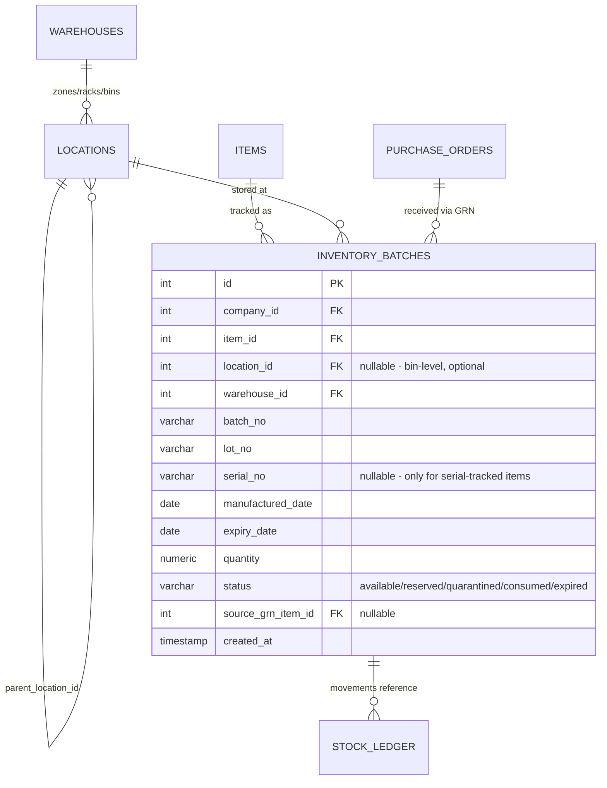
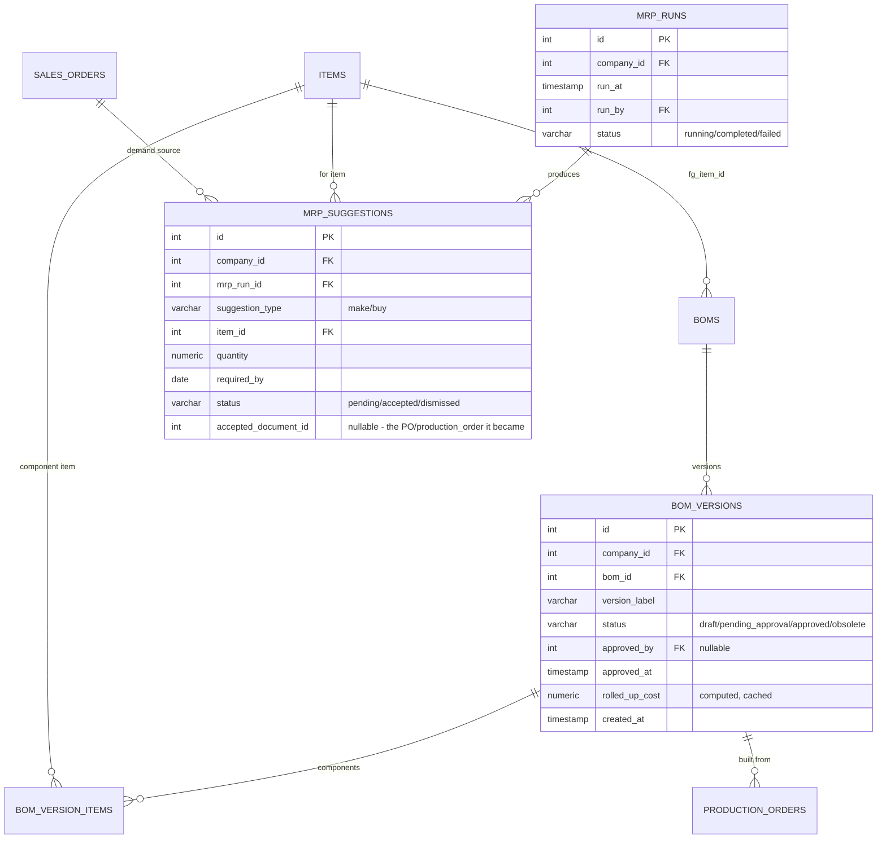
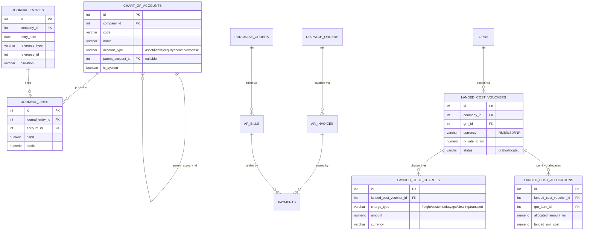
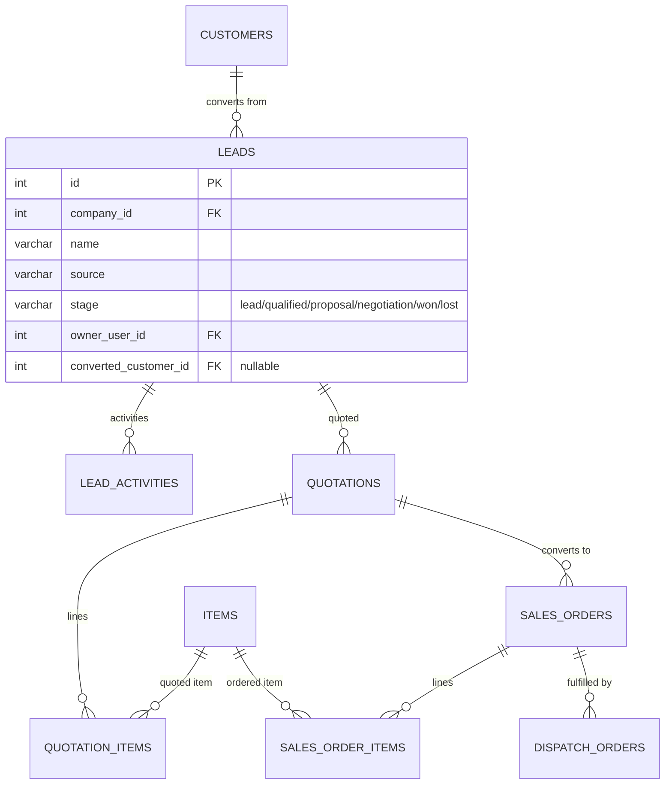
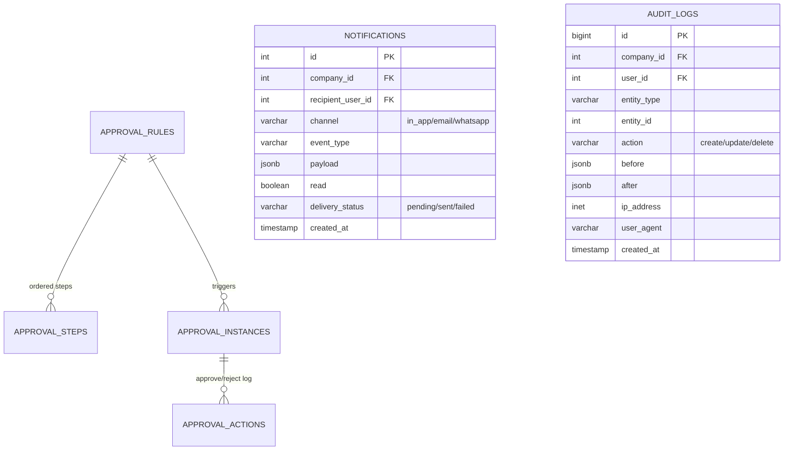

# V2 Database Design

**Companion to** [V2_ARCHITECTURE.md](./V2_ARCHITECTURE.md) §4 (data model direction). This document is the column-level detail; V2_ARCHITECTURE.md is the reasoning for *why* each table looks the way it does.

**Conventions, inherited from V1's existing migrations and kept unchanged:**
- Every tenant table carries `company_id integer NOT NULL REFERENCES companies(id)`, indexed (per the Phase 1 audit fix — every new table gets its `company_id` index from day one, not retrofitted).
- `id SERIAL PRIMARY KEY` unless a table is a pure join table (composite PK).
- `created_at`/`updated_at TIMESTAMP NOT NULL DEFAULT now()` on every table; `deleted_at TIMESTAMP` (soft delete) on master-data-shaped tables, omitted on pure transactional/ledger tables (matching V1: `items`/`suppliers`/`customers` have it, `stock_ledger` doesn't).
- Soft-deletable tables with a business-key uniqueness constraint use a **partial unique index** (`... WHERE deleted_at IS NULL`), fixing the gap the audit found in V1 (§2.5) rather than repeating it.
- Money columns: `numeric(14,2)`. Quantities: `numeric(18,3)`. FX rates: `numeric(12,6)`.

---

## 1. Inventory depth (batch/lot/serial, bins)

- `inventory_batches` is additive to `stock_items`/`stock_ledger`, not a replacement — `stock_items.quantity` stays the fast "total on hand" read; `inventory_batches` is where FEFO/FIFO picking and expiry alerts read from. A trigger or application-level invariant keeps `SUM(inventory_batches.quantity) = stock_items.quantity` per (item, warehouse); reconciliation job flags drift.
- `items` gains a `tracking_mode` enum (`none | batch | lot | serial`) — items not opted into tracking never get `inventory_batches` rows, so this is zero-cost for the ~500 SKUs that don't need it.
- Barcode/QR: `items` and `inventory_batches` both get a generated `barcode_value` (a deterministic code, e.g. `{sku}-{batch_no}` for batch-tracked, plain SKU otherwise) — generation is a pure function, not a stored image; the QR/barcode *image* is rendered on demand (label printing endpoint), never stored as a blob.
- Indexes: `(company_id, item_id, warehouse_id)`, `(company_id, expiry_date) WHERE status = 'available'` (expiry alert queries), `(company_id, batch_no)`.

## 2. Manufacturing depth (BOM versioning, MRP)

- V1's `boms`/`bom_items` (flat, single version) become `boms` (just the identity: name/code/fg_item) + `bom_versions` (the actual recipe, versioned) + `bom_version_items` (was `bom_items`) — a migration moves existing `bom_items` rows into a synthetic `V1` version per existing `bom`, preserving history rather than discarding it.
- `bom_version_items.item_id` gets the FK the audit found missing (§2.4) from day one here, and the Phase 1 fix already retrofitted it onto the V1 `bom_items` table it's migrating from.
- `mrp_suggestions.accepted_document_id` is intentionally untyped (no FK) since it points to either a `production_orders` or `purchase_orders` row depending on `suggestion_type` — resolved in the service layer, not the schema, same pattern as `stock_ledger.reference_type`/`reference_id` already uses in V1.

## 3. Finance foundation + landed costing

- `chart_of_accounts` is **seeded per company at creation time** (a standard COA template, matching the pattern `CompaniesService.createWithAdmin` already uses to bootstrap a first admin) — not something every company configures from scratch.
- Journal entries are double-entry (`SUM(debit) = SUM(credit)` per `journal_entry_id`, enforced at the application layer on write; a scheduled integrity check flags any drift).
- `landed_cost_allocations.landed_unit_cost` becomes the value `stock_items` valuation uses for that batch going forward (joins through `inventory_batches.source_grn_item_id`) — replacing the audit's noted `quantity × items.purchase_rate` valuation (§1.8) with actual landed cost once a GRN has gone through this flow; falls back to `purchase_rate` for GRNs that never get a landed-cost voucher (e.g. small domestic purchases where it's not worth the overhead).
- GST/tax: `tax_engine` is a stateless calculation service (rate lookup by HSN/SAC code + state-in/state-out for CGST/SGST vs IGST) invoked when journal lines are posted, not its own ledger — GST liability itself lives in `chart_of_accounts` as a normal liability account.

## 4. CRM + Sales

- `dispatch_orders` (V1) gains a nullable `sales_order_id` — additive, backward compatible; existing dispatch flows that don't originate from a sales order keep working unchanged.
- `leads.stage` transitions are logged to `audit_logs` (§V2_ARCHITECTURE §4) rather than a separate history table — the generic audit trail already captures before/after state per change.

## 5. Platform services

- `approval_rules.condition_expression` is a small, deliberately restricted expression string (e.g. `"total_amount > 50000"`) evaluated against the triggering document's own fields by a safe expression evaluator (not `eval()` — a whitelisted-grammar library) — configurable without code changes, per the mission's "support custom workflows" ask, without opening an injection surface.
- `audit_logs` is `bigint` PK and append-only (§V2_ARCHITECTURE §10) — it will be the second-fastest-growing table after `stock_ledger`; same partitioning consideration applies once volume warrants it.

---

## 6. Indexing strategy (applies to every new table above)

1. `(company_id)` on every tenant table, from the first migration that creates it — the Phase 1 audit fix retrofitted this onto 15 V1 tables; V2 tables don't get to accumulate the same debt.
2. Every FK column gets a supporting index — Postgres doesn't create one automatically, and the Phase 1 fix specifically had to add two that were missing on V1 line-item tables (`bom_items.item_id`, `production_order_items.item_id`); V2's line-item tables (`bom_version_items`, `quotation_items`, `sales_order_items`, `landed_cost_allocations`) get theirs at creation.
3. Composite `(company_id, status)` or `(company_id, created_at)` on every table a list/dashboard page filters or sorts by — decided per-table once the actual V2 frontend query patterns exist, not guessed here; add via migration alongside the feature, not as a later cleanup pass.
4. Partial indexes for soft-delete uniqueness (`... WHERE deleted_at IS NULL`) wherever a table combines both, per §Conventions above.

## 7. Partitioning

`stock_ledger` and `audit_logs` are the two tables where the mission's stated scale (1M+ inventory transactions) makes partitioning a when-not-if. Recommended: **range partition by `created_at`, monthly**, with `company_id` as the leading column in every index within each partition (not partitioning *by* `company_id` — most single-tenant query patterns still filter by date range for reports, and monthly partitions let old data be archived/dropped cheaply). Implement when either table's row count approaches ~10M in staging load testing (§V2_ARCHITECTURE §11), not preemptively — partitioning adds operational complexity (partition maintenance, `pg_partman` or a scheduled job to create future partitions) that isn't worth paying for before it's needed.

## 8. Multi-company defaults

Every new master-data-shaped table that benefits from sensible defaults (`chart_of_accounts`, default `approval_rules` for common cases like "PO over threshold needs approval", a default set of `roles`/`permissions` beyond V1's existing system roles) is seeded **per company at creation time**, extending `CompaniesService.createWithAdmin`'s existing bootstrap pattern rather than requiring every new tenant to configure V2's platform services from a blank slate.
