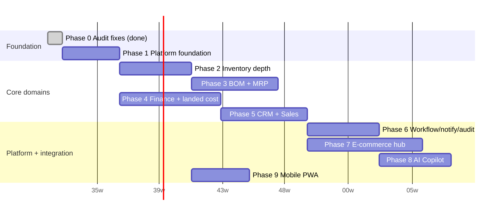

# TITAN Roadmap

**Companion to** [V2_ARCHITECTURE.md](./V2_ARCHITECTURE.md) and [DATABASE_DESIGN.md](./DATABASE_DESIGN.md). This document sequences the work; those documents describe what the work is.

**Effort estimates are rough order-of-magnitude for a small team (2–4 engineers), not a commitment** — they exist to show relative size and dependency ordering, not to be quoted as a delivery date. Every phase ends with a working, deployed increment — nothing here is "build for 6 months, then ship."

---

## Phase 0 — Audit fixes (done)

Status: **complete**, see [AUDIT_REPORT.md](./AUDIT_REPORT.md) and the 7 commits on `ui/premium-design-system` (dead code removal, missing FKs, missing indexes, stock race condition, rate limiting, CORS, unused deps). This phase exists in the roadmap only to record that it's the foundation everything below assumes.

## Phase 1 — Platform foundation (~3–5 weeks)

**Why first:** every later phase adds load and adds developers touching tenant-scoped data. Get the structural guarantees and operational basics in place before that multiplies, not after.

- Tenant isolation: `TenantScopedRepository` base class + Postgres RLS backstop (V2_ARCHITECTURE §3).
- Redis: session/permission cache, dashboard cache, throttler storage backend (V2_ARCHITECTURE §7).
- Observability: structured logging, `/health` endpoint, request correlation ids.
- CI pipeline: the audit found none exists (§1.5) — add one now (lint + test + build gate on every PR) so every subsequent phase's work is actually protected by it, not just this one.
- Confirm/complete `PermissionsGuard`/`@RequirePermissions()` wiring (audit §1.4) — V2's RBAC role list depends on fine-grained permissions actually being enforced.
- Docker Compose for local dev (Postgres + Redis + backend + frontend) — closes the "no docker-compose" gap (audit §1.5) that makes onboarding a new contributor harder than it needs to be.

**Exit criteria:** a new module can be written against `TenantScopedRepository` and trust tenant isolation structurally; CI blocks a broken PR; local dev is a single `docker compose up`.

## Phase 2 — Inventory depth (~4–6 weeks)

Depends on: Phase 1 (new tables should be built on the tenant-scoped base from day one).

- `inventory_batches` (batch/lot/serial/expiry tracking), `items.tracking_mode`.
- Warehouse zones/racks/bins — activate V1's existing `locations` hierarchy for this purpose (already schema-ready, audit §1.8) rather than building new tables.
- Barcode/QR generation + a scan-driven stock-in/out flow (backend endpoints; the actual scanning UI can be web-first, ahead of the Mobile PWA in Phase 9).
- Cycle count / physical verification workflow.
- Seed data strategy (V2_ARCHITECTURE §9) gets implemented as a real `seed.ts` here — inventory depth is exactly the domain the mission's sample-data ask (500 SKUs, 5,000+ transactions) exercises, so build the seed script alongside the tables it populates.

**Exit criteria:** a GRN can receive tracked batches into specific bins; expiry/low-stock alerts work off `inventory_batches`; seed script produces the mission's target volumes end-to-end through real service calls (exercising the Phase 0 concurrency fix under load).

## Phase 3 — Manufacturing depth: BOM versioning + MRP (~5–7 weeks)

Depends on: Phase 2 (MRP nets against real batch-level stock).

- BOM versioning/approval/cost-rollup (`boms` → `bom_versions` → `bom_version_items`, migrating V1's flat `bom_items`).
- Waste tracking (scrap/rework/byproducts) on production orders.
- MRP engine (V2_ARCHITECTURE §5) — demand → explosion → shortage/suggestions, run as an async job (Phase 1's queue infra).

**Exit criteria:** planner can run MRP against real open demand + BOMs and get actionable make/buy suggestions with correct multi-level explosion; a suggestion converts to a real PO/production order in one action.

## Phase 4 — Finance foundation + landed costing (~6–8 weeks)

Depends on: Phase 1 (tenant-scoped, needs the queue for allocation jobs). Independent of Phases 2–3 otherwise — **can run in parallel** with them if team capacity allows, since finance's dependencies are on GRN/dispatch (already exist in V1), not on inventory-depth or MRP.

- Chart of accounts (seeded per company), journal entries/lines (double-entry core).
- AR/AP against existing `dispatch_orders`/`purchase_orders`.
- Tax engine (GST).
- Landed cost engine — this is the mission's explicitly flagged "critical" item; sequence it as soon as finance's double-entry core exists, since landed cost *posts into* that ledger rather than existing standalone.
- P&L / Balance Sheet / Cash Flow reports, built on the journal.

**Exit criteria:** a GRN with real freight/customs/duty/GST/clearing charges produces a correct per-SKU landed unit cost, and that cost flows into inventory valuation; a P&L for a date range reconciles against manually-verified journal entries for a seeded test company.

## Phase 5 — CRM + Sales (~5–7 weeks)

Depends on: Phase 4 (invoicing needs AR) — **can start in parallel** with Phase 4 for the lead/quotation/sales-order pieces that don't touch invoicing yet.

- Lead pipeline (lead → qualified → proposal → negotiation → won/lost), activities/notes/follow-ups/tasks, customer timeline.
- Quotations, Sales Orders (dispatch becomes SO fulfillment — `dispatch_orders.sales_order_id`).
- Invoicing + payment tracking against AR.

**Exit criteria:** a lead converts through the full pipeline to a dispatched, invoiced, paid sales order without manual data re-entry at any step.

## Phase 6 — Platform services: workflow, notifications, audit trail, executive dashboard (~4–6 weeks)

Depends on: enough real documents/events to be worth approving/notifying about — practically, after Phase 4/5 exist, though the *engines themselves* (workflow rule evaluation, notification delivery, audit subscriber) are domain-agnostic and could be built earlier if a team wants the audit trail covering Phases 2–5's development.

- Configurable approval workflow engine (V2_ARCHITECTURE §4) — wire real rules onto POs and Sales Orders first (the mission's example), extend to other documents as needed.
- Notification center (in-app + email now, WhatsApp-ready architecture — actual WhatsApp Business API integration can slip to a later phase without blocking the architecture).
- Audit trail (`@Auditable()` subscriber) — **recommend pulling this earlier if feasible**, since retrofitting audit coverage onto Phases 2–5's tables after the fact means those tables have a gap in their history; the subscriber pattern (V2_ARCHITECTURE §4) makes "tag the entity, get coverage" cheap enough to do incrementally rather than as one big-bang phase.
- Executive dashboard v2 (real revenue/GP/NP/inventory-turnover/receivables/payables/cash, cached + lightly real-time per V2_ARCHITECTURE §6).

**Exit criteria:** a PO over a configured threshold routes through real approvers and can't be self-approved; a low-stock event produces an in-app + email notification; every write to a tagged entity has a queryable before/after audit row; the executive dashboard shows real numbers from Phases 2–5's data.

## Phase 7 — E-commerce integration hub (~6–10 weeks, scales with # of connectors)

Depends on: Phase 2 (inventory sync needs real stock/batch data), Phase 5 (order sync needs Sales Orders).

- Connector framework: a common interface (Order Sync / Inventory Sync / Return Sync / Settlement Sync) + credential storage (encrypted, V2_ARCHITECTURE §10).
- First connector (recommend starting with whichever marketplace the business actually sells on today, not alphabetically) — proves the framework end-to-end before building the remaining four.
- Remaining connectors (Amazon/Flipkart/Meesho/Shopify/ONDC) — each is mostly independent integration work once the framework and first connector exist; can be parallelized across engineers or sequenced by business priority.

**Exit criteria:** an order placed on the first integrated marketplace creates a real Sales Order, decrements real stock, and a return/settlement on that marketplace reconciles back correctly.

## Phase 8 — AI Copilot (~4–6 weeks for a first useful slice)

Depends on: Phases 2–6 (it queries their data) — deliberately late, per V2_ARCHITECTURE §12.

- AI service layer: routes natural-language questions to the same tenant-scoped application services everything else uses (V2_ARCHITECTURE §10's security boundary), never raw DB access.
- Start with read-only Q&A (low stock, profit trend explanation, demand forecast against real MRP data) — the mission's example questions. Defer any AI-initiated *write* action (e.g. "auto-create a PO") well past this phase; that's a much bigger trust/safety surface than answering questions.

**Exit criteria:** the mission's example questions ("why did profit decrease," "show low stock items," "forecast demand") return correct, tenant-scoped answers grounded in real data, with no path for a crafted question to access another company's data.

## Phase 9 — Mobile PWA (~3–5 weeks)

Depends on: Phase 2 (scan-driven stock in/out already has backend endpoints from Phase 2's barcode work) — this phase is mostly frontend.

- PWA shell (offline-capable shell, install prompt), scoped local cache per V2_ARCHITECTURE §10.
- Warehouse-user flows: scan barcode, stock in/out, transfer, production updates — reusing Phase 2's backend endpoints, not new ones.

**Exit criteria:** a warehouse user can complete a full stock-in cycle on a phone, offline, with sync-on-reconnect.

---

## Cross-cutting: performance validation

Not a phase — a **recurring checkpoint after every phase that adds meaningful write volume** (Phases 2, 3, 5, 7): re-run the seed script at the mission's target volumes (100k+ orders, 1M+ inventory transactions) against a staging environment sized like production, and confirm dashboard/report load times and query plans still hold (V2_ARCHITECTURE §11). Treat a regression here as a blocker for the next phase, not a backlog item — it's much cheaper to fix a slow query against the module that just introduced it than to debug it three phases later.

## Sequencing summary

*(Start date above is illustrative — anchor it to whenever Phase 1 actually kicks off, not a commitment. Relative week-offsets and dependency ordering are what matters here, not the specific calendar dates.)*

Phases 4 and 2 both depend only on Phase 1 and can run in parallel tracks; Phase 9 only depends on Phase 2 and can start well before Phase 6–8 finish. Phases 3, 5, 6, 7, 8 are each gated by real dependencies (BOM/MRP needs real batch stock; Sales needs AR; workflow/audit are most valuable once there's real document volume; e-commerce needs Sales Orders; AI needs everything to query) — don't parallelize past what the dependency graph in V2_ARCHITECTURE §2 actually allows.
