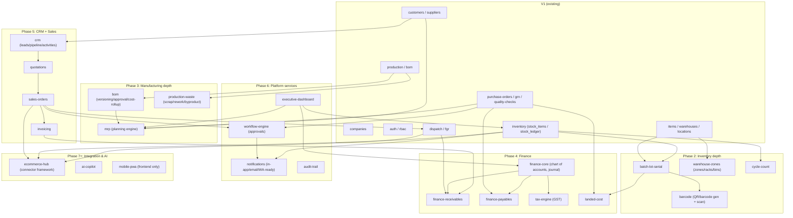

# ERP Manufacturing V2 Enterprise ("TITAN") — Architecture

**Status:** Design, not yet implemented.
**Builds on:** [AUDIT_REPORT.md](./AUDIT_REPORT.md) — every decision below either fixes a finding there or extends a pattern that audit confirmed already works.
**Companion docs:** [DATABASE_DESIGN.md](./DATABASE_DESIGN.md) (schema), [ROADMAP.md](./ROADMAP.md) (phasing/sequencing), migration strategy and seed data strategy (below, §8–9), security review and performance plan are their own sections here (§10–11) rather than separate files — they're architecture decisions, not independent artifacts.

---

## 1. Guiding constraints

1. **V1's foundation is good enough to build on, not replace.** NestJS + TypeORM + Postgres, module-per-domain, global DTO validation, a real response envelope, real migrations, and — the hard part — working per-request tenant scoping. V2 extends this shape; it does not rewrite it.
2. **Modular monolith, not microservices — for now.** Eighteen feature domains sound like a microservices pitch, but splitting them into separate deployable services today would multiply operational cost (18 CI pipelines, 18 deploy targets, distributed transactions for something as basic as "dispatch decrements stock and writes a ledger row") without a scaling problem that requires it. Keep one NestJS app, enforce domain boundaries with **module encapsulation** (a module only imports another module's exported service, never reaches into its repository or entities directly — already the convention in V1). Revisit only if a specific domain (e.g. the AI Copilot, or an e-commerce sync worker) needs independent scaling or a different runtime.
3. **Tenant isolation must become structural, not conventional.** The audit's single biggest structural risk (§1.4): every service method *remembers* to filter by `company_id`. That's worked so far because the codebase is small and disciplined. It will not survive 18 new domains written by more people over more time. V2's data-access layer must make forgetting `company_id` hard to do by accident, not just hard to get past review. See §3.
4. **Every new domain is additive to the schema, never a breaking change to V1's tables** unless the audit already flagged that table as broken (e.g. dead `quality_check_items`, already fixed). New foreign keys point *into* existing tables (e.g. `batches.item_id → items.id`); V1 tables gain nullable/defaulted columns, never a required column with no backfill plan.

---

## 2. Module map

New top-level NestJS modules, grouped by roadmap phase (see ROADMAP.md for sequencing/dependencies):

Each new module follows V1's existing shape: `*.entity.ts`, `*.service.ts`, `*.controller.ts`, `dto/`, `*.module.ts`, registered in `app.module.ts`. No new architectural pattern is introduced at the module level — the changes that matter are underneath it (§3–6).

---

## 3. Tenant isolation: from convention to structure

**Problem (AUDIT_REPORT.md §1.4):** every V1 service method takes an explicit `companyId` and filters on it. Consistent today, but nothing stops a new method — in any of the ~15 new modules above — from being written without that filter. The failure mode is silent: company A sees company B's data, discovered by a customer, not a test.

**V2 approach — layered, not a single silver bullet:**

1. **A `TenantScopedRepository<T>` base class** wrapping TypeORM's `Repository<T>`, constructed with `companyId` bound at request scope (via a Nest `REQUEST`-scoped provider reading `CompanyId()`'s value). Every `find`/`findOne`/`save`/`softDelete` call on it automatically ANDs in `company_id = :companyId` — a developer has to actively opt out (a clearly-named `.unscoped()` escape hatch, used only for the handful of legitimately cross-tenant SUPERADMIN operations already identified in `companies.controller.ts`) rather than opt in. New modules extend this base instead of injecting a bare `Repository<T>`. V1's existing modules migrate to it opportunistically (not a forced big-bang rewrite — both patterns can coexist during the transition, since the underlying tables and filtering logic are identical).
2. **Postgres Row-Level Security (RLS) as the defense-in-depth backstop**, not the primary mechanism. Every tenant table gets an RLS policy (`USING (company_id = current_setting('app.current_company_id')::int)`), and the app sets `app.current_company_id` via `SET LOCAL` at the start of each request's transaction (a small interceptor, not per-query code). This means even a query that somehow bypasses `TenantScopedRepository` — raw SQL, a `QueryBuilder` someone hand-writes, a future ORM migration — still can't cross tenants, because the database itself refuses. RLS is the single structural guarantee the audit found missing; everything else is discipline with a safety net.
3. **A CI lint rule** (a small custom ESLint rule, or a repo-wide test that scans compiled query metadata) flagging any `@InjectRepository` outside the tenant-scoped base class in a module tagged tenant-scoped, so the gap between "we intended structural isolation" and "someone bypassed it" is caught before merge, not after a support ticket.

This is intentionally the first work item in the roadmap (Phase 1, before any new domain lands) — every subsequent domain should be built *on* the safe pattern, not retrofitted onto it later.

---

## 4. Data model direction (detail in DATABASE_DESIGN.md)

- **Batch/lot/serial/expiry tracking** attaches to `stock_items`/`stock_ledger` via a new `inventory_batches` table (one row per received batch/lot/serial unit), not by exploding `items` into batch-specific rows. `stock_items` keeps representing "total on-hand for item+warehouse"; `inventory_batches` represents "which specific batches make up that total," FK'd to both `items` and the warehouse-bin hierarchy below. FEFO/FIFO picking logic reads from `inventory_batches`, not `stock_items`, once this ships.
- **Warehouse zones/racks/bins**: V1's `locations` table already has a `location_type` enum (`area/rack/bin/floor/cold_storage/quarantine`) and a self-referencing `parent_location_id` — it's the right shape for a zone→rack→bin hierarchy already, just unused for that purpose today. V2 adds `bin_id` as an optional FK on `inventory_batches` (and, later, `stock_items`) rather than inventing a parallel hierarchy.
- **Finance** is a genuinely new subsystem: `chart_of_accounts`, `journal_entries` + `journal_lines` (double-entry), `ar_invoices`/`ap_bills` linked back to `dispatch_orders`/`purchase_orders` respectively. Landed cost (§ below) posts into this ledger, not around it.
- **Landed cost**: a `landed_cost_vouchers` table per shipment/GRN, `landed_cost_charges` (freight/customs/duty/GST/clearing/transport lines, each with a currency + FX rate to INR), and an allocation step that distributes those charges across the GRN's line items by value or weight to produce a per-SKU landed unit cost — which then becomes the `stock_items` valuation basis instead of `items.purchase_rate` alone (audit finding §1.8: valuation today is just `quantity × purchase_rate`, no landed cost concept exists).
- **CRM/Sales** reuses `customers` (already multi-company, already has credit_limit/payment_terms) and adds `leads`, `quotations`, `sales_orders` ahead of the existing `dispatch_orders` — i.e. dispatch becomes a *fulfillment* of a sales order rather than a standalone document, which is a genuine (if minor) V1 schema evolution: `dispatch_orders` gains an optional `sales_order_id`.
- **Workflow engine**: generic — `approval_rules` (module + condition expression, e.g. "po.total_amount > 50000"), `approval_steps` (ordered approver roles), `approval_instances` (one per document awaiting approval, polymorphic reference to `purchase_orders`/`sales_orders`/etc. via `document_type` + `document_id`). Deliberately data-driven so "PO > ₹50,000 → Manager → Director" is configuration, not a new code path per rule.
- **Audit trail**: a single `audit_logs` table (user, timestamp, entity type, entity id, action, before/after JSON diff, ip, user agent), written by a TypeORM subscriber hooked to `AfterInsert`/`AfterUpdate`/`AfterRemove` on every entity tagged with an `@Auditable()` class decorator — not hand-added logging calls scattered through services, which is how audit trails silently stop covering new code.

Full column-level design: [DATABASE_DESIGN.md](./DATABASE_DESIGN.md).

---

## 5. MRP engine (design sketch)

The mission's core ask — "Customer Demand → Production Requirement → Material Requirement → Purchase Requirement, generate shortages automatically" — is a batch calculation, not a live service call:

1. **Demand sources**: open `sales_orders` (Phase 5) + a manually-entered forecast row (for demand before Sales/CRM ships, so MRP isn't blocked waiting on Phase 5).
2. **Explosion**: for each demand line, walk the item's active BOM (versioned — §V2 BOM) recursively (multi-level BOM) to compute gross material requirement per component, netted against on-hand `stock_items` + already-open `production_orders`/`purchase_orders` for that component to get net requirement.
3. **Output**: a `mrp_run` record (point-in-time snapshot, not live-recalculated on every read — re-running MRP is an explicit action, matching how real planners work) producing `mrp_suggestions` rows: "make X of item A" (→ suggested production order) or "buy Y of item B by date D" (→ suggested PO), each traceable back to the demand line(s) that generated it.
4. **Shortage detection** falls out of the same netting step: any component where required > (on-hand + on-order) is a shortage, surfaced on the MRP run's summary and the executive dashboard.

This is intentionally a **suggestion engine**, not an auto-committing one — a planner reviews `mrp_suggestions` and converts the ones they accept into real production/purchase orders (one click, pre-filled). Auto-creating orders from a first-pass MRP algorithm without human review is how you get real POs sent to real vendors for a demand forecast that was wrong.

---

## 6. Executive dashboard & real-time updates

V1's `DashboardController.getDashboardSummary` (audit §1.6) already does the right thing structurally — `Promise.all` of several count/aggregate queries — it just doesn't cache and will need the new finance/MRP data sources. V2 dashboard:
- Same pattern, more sources (revenue/GP/NP from finance, inventory turnover from `stock_ledger`, open PO/PO/SO counts, receivables/payables aging from finance, cash position).
- **Cached, not live-computed, per request** — a short-TTL (30–60s) cache per `company_id` (Redis, see §7), invalidated eagerly on the write paths that matter most (a new dispatch, a payment recorded) and by TTL otherwise. "Real-time updates preferred" (mission ask) is satisfied via a lightweight SSE/WebSocket push on cache invalidation for the handful of KPI tiles that benefit most (open orders, low stock) — not a rearchitecture of the whole dashboard into a streaming system.

---

## 7. Cross-cutting infrastructure additions

- **Redis**: session/permission cache (closes the audit's per-request live-permission-lookup cost, §1.6), dashboard cache, `@nestjs/throttler`'s storage backend at multi-instance scale (today's in-memory throttler storage, added in the Phase 1 fixes, doesn't share state across instances — fine for one instance, needs a Redis storage adapter once the app runs behind a load balancer).
- **A job queue (BullMQ on Redis)** for anything that shouldn't block an HTTP response or that needs retry semantics: MRP runs, e-commerce order/inventory sync, notification delivery (email/WhatsApp), landed-cost allocation on a large GRN, audit-log writes for high-volume entities if the synchronous subscriber approach (§4) turns out too slow under load.
- **API versioning**: introduce `/api/v2/...` alongside the existing `/api/...` (treated as `v1`) for any endpoint whose *shape* changes (not additive fields — those stay backward compatible on the existing routes). Most V2 work is new endpoints on new modules, which don't need versioning at all; version only where a V1 contract must actually change.
- **Observability**: structured logging (pino, replacing bare `console.log`), a `/health` endpoint (DB + Redis connectivity) for container orchestration, and basic request tracing (correlation id per request, threaded through the job queue for async work) — none of this exists in V1 today and all of it is cheap, foundational, and worth doing early (Phase 1) rather than retrofitting once 18 modules are logging inconsistently.

---

## 8. Migration strategy

- **Every schema change is a TypeORM migration, hand-reviewed** — V1 already made the right call turning off `synchronize` (audit §1.2); V2 does not regress that. New migrations follow the existing file convention (`{timestamp}-{Name}.ts`) and, per the Phase 1 fix precedent, are hand-authored against the entity + existing migration conventions when generating against a live dev DB isn't available, always reviewed against a real Postgres instance before merge.
- **Additive-first**: new tables and nullable/defaulted new columns ship independently of the feature code that populates them, so a migration can run (and be verified) before the feature toggles on. A required column on an existing table (e.g. eventually making `dispatch_orders.sales_order_id` required once Sales Orders are the only path) ships as two migrations across two releases: add nullable → backfill → add NOT NULL, never one migration that could fail on existing rows.
- **Backward-compatible for one release**: a migration that changes an existing column's meaning or removes one only ships after the code path using the old meaning has been removed from the previous release — no migration and its consuming code deploy in the same release if the migration is destructive.
- **Every migration gets a working `down()`** (already the convention in V1's migrations) and is tested by running `migration:run` then `migration:revert` then `migration:run` again against a scratch DB before merge — catches the class of bug where `down()` was written but never actually exercised.
- **Multi-company backfill risk**: several V2 tables (finance, CRM) will need one-time backfill per existing company (e.g. a default Chart of Accounts seeded per company on creation, matching how `companies.service.ts`'s `createWithAdmin` already bootstraps a first admin+role together). New companies get the full V2 default data at creation time; existing companies get a backfill migration/script run once.

## 9. Seed data strategy

**Goal**: realistic, referentially-valid, idempotent seed data for local dev and load-testing — 3 companies / 5 warehouses / 50 vendors / 200 customers / 500 SKUs / 100 POs / 300 SOs / 100 production orders / 5,000+ inventory transactions (per the mission's sample-data ask).

- **Tool**: a TypeScript seed script (`erp-backend/src/seed/seed.ts`, run via `ts-node` like the existing `migration:*` scripts) using `@faker-js/faker` for realistic names/addresses/SKUs, not a hand-written `seed.sql` — SQL would have to hand-compute every FK id and hash every password, which is exactly the kind of thing that silently drifts from the entity definitions. The script uses the same `AppDataSource` (`data-source.ts`) and repositories the app itself uses, so it can never insert data the entities/constraints wouldn't accept.
- **Order of generation respects FK dependencies**: companies → warehouses/locations → users+roles (one COMPANY_ADMIN + a few role variants per company, matching `createWithAdmin`'s pattern) → suppliers/customers/items → BOMs → purchase orders → GRNs (→ stock increase, exercising `InventoryService.increaseStock`, the just-fixed locked path) → quality checks → production orders (→ stock decrease/increase for consumption/output) → dispatch orders (→ stock decrease). **Every stock movement in the seed goes through `InventoryService`, not a raw insert into `stock_items`/`stock_ledger`** — that's both a correctness requirement (the ledger must actually reconcile with the balances) and free exercise of the Phase 1 concurrency fix under realistic volume.
- **Volume knobs are parameters**, not hardcoded — `npm run seed -- --companies=3 --skus=500 ...` with the mission's numbers as defaults, so the same script scales down for a fast local run or up for a load test approaching the 100k-orders/1M-transactions target.
- **Idempotent**: re-running the script against a DB it already seeded detects existing seed-tagged companies (a `is_seed_data: true` flag or a well-known company name prefix) and either skips or truncates-and-regenerates (a `--reset` flag), rather than silently duplicating data on a second run.
- **Never runs against a DB with `NODE_ENV=production`** — a hard guard at the top of the script, matching the caution the audit raised about the codebase's general lack of environment guardrails.

---

## 10. Security review (V2-specific, extends AUDIT_REPORT.md §1.7)

New attack surface introduced by TITAN's scope, beyond what Phase 1 already fixed:

| Area | Risk | Mitigation |
|---|---|---|
| **RLS bypass** | A future raw query or admin script forgets tenant scoping | Postgres RLS as structural backstop (§3) — the point of adding it is that app-layer bugs can't cross tenants |
| **E-commerce connector credentials** | Amazon/Flipkart/Shopify API keys per company, stored in the DB | Encrypt at rest (column-level encryption or a secrets manager reference, never plaintext in `companies`-adjacent tables); scope each connector's stored token to least-privilege API scopes the marketplace offers |
| **Workflow engine approval bypass** | A user self-approves their own PO by being both requester and approver | Approval step evaluation must reject an approver id equal to the document's creator id, enforced server-side in the workflow engine, not just hidden in the UI |
| **AI Copilot data exposure / prompt injection** | "Why did profit decrease?" requires the AI to query real financial data — a malicious or malformed query could be used to exfiltrate cross-tenant data via a crafted prompt, or the AI's generated query could itself bypass tenant scoping | AI layer never gets raw DB access — it calls the same `TenantScopedRepository`-backed application services everything else uses, with `company_id` injected server-side from the authenticated session, never accepted as part of the AI's own reasoning/output. Treat any AI-generated query/filter as untrusted input requiring the same validation as user input. |
| **Mobile PWA offline data** | Warehouse scanning app caches stock/item data locally for offline use | Cache only what's needed for the offline window, scoped to the user's company and role; wipe on logout; no offline cache of financial/PII data |
| **Audit trail as an attack target** | An `audit_logs` table is only useful if it can't itself be tampered with | Insert-only at the application layer (no `UPDATE`/`DELETE` grants on that table for the app's DB role); consider a periodic export to append-only storage for anything audit-sensitive (finance, RBAC changes) |
| **Notification content leakage** | Email/WhatsApp notifications about business events could leak sensitive data (e.g. a PO amount) to the wrong recipient if a template renders the wrong company's data | Notification templates receive pre-scoped data from the triggering service, never re-fetch by loose ids; recipient resolution always goes through the same tenant-scoped user/role lookup as everything else |

Also carried forward as still-open from Phase 1 and worth closing before V2 features multiply the number of endpoints: repo-wide confirmation of whether `PermissionsGuard`/`@RequirePermissions()` is actually wired anywhere (audit §1.4) — V2's RBAC role list (Super Admin/Company Admin/Purchase Manager/.../Employee) implies fine-grained module/screen/action/API/data permissions are load-bearing, so this needs to be true before those roles are relied on, not after.

---

## 11. Performance optimization plan (V2-specific, extends AUDIT_REPORT.md §2.6/§3.5)

1. **Everything in the Phase 1 fixes lands first** (indexes, locking, rate limiting) — V2 features compound load on the same tables, so building on an unindexed/unlocked foundation multiplies the eventual cost of fixing it.
2. **`stock_ledger` partitioning** (audit §2.6) — partition by `company_id` range or by month before the table approaches the 1M-transaction target, not after. Table partitioning changes query plans and requires app-level awareness (queries should still filter by the partition key); do this as a deliberate migration with a maintenance window, not silently.
3. **Read replicas for reporting** — `reports.service.ts` and the executive dashboard are read-heavy and tolerate slight staleness; once there's real write load from 18 modules, point reporting queries at a read replica rather than competing with transactional writes on the primary.
4. **MRP runs are async and queued** (§7) — a multi-level BOM explosion across 500+ SKUs is not request/response work.
5. **Load-test against the mission's stated targets before calling any phase done** — 100k+ orders, 1M+ inventory transactions, using the seed data strategy's volume knobs (§9) to actually generate that volume in a staging environment, not estimated from first principles. This should be a standing step in the roadmap (§ROADMAP.md), not a one-time audit item.

---

## 12. What's deliberately deferred

Some mission items are genuinely architecture-shaped but low-value to design in detail before the domains under them exist:
- **AI Copilot** — the security posture (§10) and the "never gets raw DB access" boundary are the load-bearing design decisions now; the actual query-planning/LLM-integration layer is easier to design well once Finance/MRP/Inventory-depth (its main data sources) actually exist to query.
- **E-commerce connector framework** — the boundary (§10, connector credentials + a common Order/Inventory/Return/Settlement sync interface) is worth fixing now; building out Amazon/Flipkart/Meesho/Shopify/ONDC-specific connectors is pure integration work best sequenced after Sales/Inventory are solid, per ROADMAP.md.
- **Mobile PWA** — a frontend concern layered on the same `/api` the web app uses; no backend architecture decision is blocked on it, so it's sequenced late in the roadmap rather than designed here.
